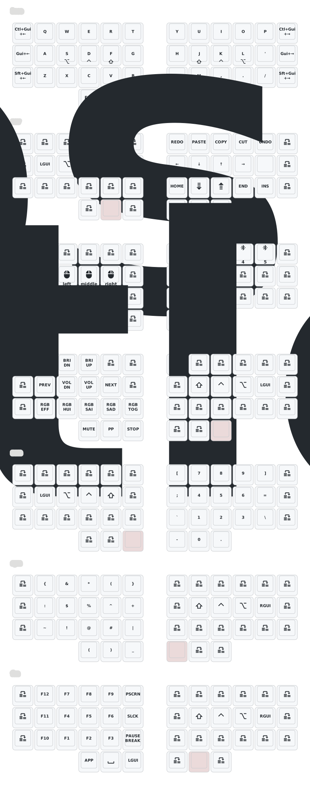

# Crosses

A 42-key split ergonomic keyboard with PMW3610 trackball and OLED displays

This build uses diode-direction as "row2col" and differs from the original GGGW Crosses keyboard, also in GPIOs.


## Keymap



## Features

- **42 keys** (3x6 + 3 thumb keys per side)
- **PMW3610 trackball** on the right side
- **SSD1306 OLED displays** on both sides (128x32)
- **ZMK Studio** support for real-time keymap editing
- **Miryoku-inspired** layout with home row mods

## Hardware

| Component | Specification |
|-----------|---------------|
| MCU | nice!nano v2 |
| Switches | Kailh Choc |
| Trackball | PMW3610 sensor |
| Display | SSD1306 0.91" OLED (128x32) |

## Building Firmware

### Option 1: GitHub Actions (Recommended)

Push changes to the repository and GitHub Actions will automatically build the firmware. Download the `.uf2` files from the Actions artifacts.

### Option 2: Local Build with Docker

#### Prerequisites

```bash
# Install Docker, then pull the ZMK image
docker pull zmkfirmware/zmk-dev-arm:stable
```

#### Build Commands

```bash
# First time: Initialize ZMK workspace (only needed once, ~5-10 min)
./build-local.sh init

# Build all firmware (left, right, settings_reset)
./build-local.sh all

# Build individual sides
./build-local.sh left    # Left side only
./build-local.sh right   # Right side (with ZMK Studio)
./build-local.sh reset   # Settings reset firmware

# Maintenance
./build-local.sh clean   # Clear builds, keep ZMK cache
./build-local.sh purge   # Delete everything, start fresh
```

#### Output

Firmware files will be in the `./firmware/` folder:
- `nice_nano_v2-crosses_left.uf2`
- `nice_nano_v2-crosses_right.uf2`
- `nice_nano_v2-settings_reset.uf2`

## Flashing

1. **Enter bootloader**: Double-tap the reset button on your nice!nano
2. **Mount**: A USB drive named `NICENANO` will appear
3. **Flash**: Drag the `.uf2` file to the drive
4. **Repeat** for the other half

### Troubleshooting

If you have Bluetooth pairing issues:
1. Flash `settings_reset.uf2` to **both** halves
2. Remove the keyboard from your computer's Bluetooth settings
3. Flash the regular firmware to both halves
4. Re-pair

## Layers

| Layer | Activation | Description |
|-------|------------|-------------|
| BASE (0) | Default | QWERTY with home row mods |
| NAV (1) | Hold Backspace | Navigation, arrows, editing |
| MOUSE (2) | Hold Escape | Mouse buttons (trackball for movement) |
| MEDIA (3) | Hold Insert | Media controls, RGB, brightness |
| NUM (4) | Hold Tab | Number pad |
| SYM (5) | Hold Enter | Symbols |
| FUN (6) | Hold Space | Function keys F1-F12 |

## Trackball

- **Normal mode**: Move cursor (BASE layer)
- **Scroll mode**: Hold NAV layer (layer 1) and move trackball
- **Buttons**: Hold MOUSE layer (layer 2)

## Configuration Files

| File | Purpose |
|------|---------|
| `config/crosses.keymap` | Keymap and layers |
| `config/crosses.conf` | Global settings (sleep, Bluetooth) |
| `config/boards/shields/crosses/crosses_right.conf` | Right side (trackball) |
| `config/boards/shields/crosses/crosses_left.conf` | Left side |

## ZMK Studio

The right side has ZMK Studio enabled. Connect via USB and visit [ZMK Studio](https://zmk.studio) to edit your keymap in real-time.

## Keymap Drawer

The keymap visualization is automatically generated using [keymap-drawer](https://github.com/caksoylar/keymap-drawer).

### Automatic Updates

A GitHub Actions workflow automatically regenerates the keymap SVG when you push changes to:
- `config/crosses.keymap`
- `config/*.dtsi`
- `keymap_drawer.config.yaml`

The generated files are saved to `keymap-drawer/` folder.

### Manual Generation

To generate the keymap locally:

```bash
# Install keymap-drawer
pip install keymap-drawer

# Parse the keymap
keymap -c keymap_drawer.config.yaml parse -z config/crosses.keymap > keymap.yaml

# Draw the SVG
keymap -c keymap_drawer.config.yaml draw keymap.yaml > keymap.svg
```

### Configuration

The `keymap_drawer.config.yaml` file customizes:
- **Styling**: Colors, fonts, key appearance
- **Glyphs**: Icons for special keys (media, modifiers, etc.)
- **Layout**: Ortho split 3x6+3 configuration
- **Key mappings**: How ZMK keycodes are displayed

## Credits

- [HeeTuic - this Crosses build](https://github.com/HeeTuic/zmk-for-crosses)
- [GGGW Crosses Keyboard](https://github.com/Good-Great-Grand-Wonderful/crosses)
